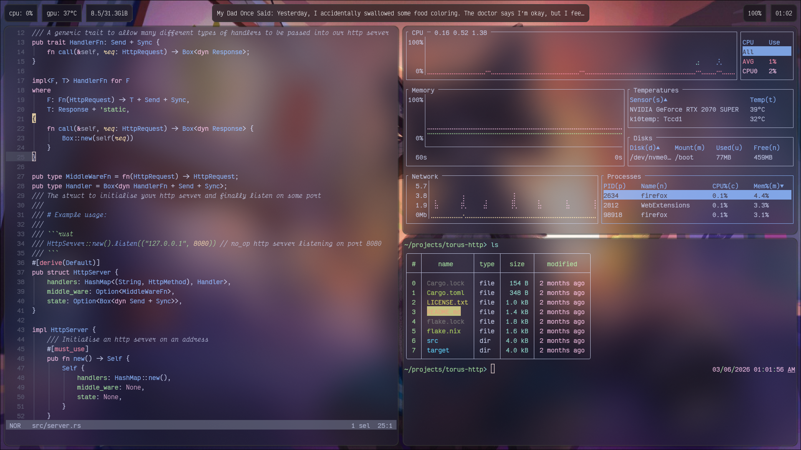

# AfkaraLP Nixos Config

My Nixos Config for the system I daily drive.

> [!NOTE]
> Most of the work I do is done with [Dev Flakes](https://github.com/the-nix-way) so a lot of development environment has to be set up yourself. Furthermore this is not fully self-contained and some config like Hyprland is done in [my dotfiles](https://github.com/AfkaraLP/dotfiles), so to completely reproduce my build you will need that as well.

To set up your wallpaper put images in ~/wallpapers.

